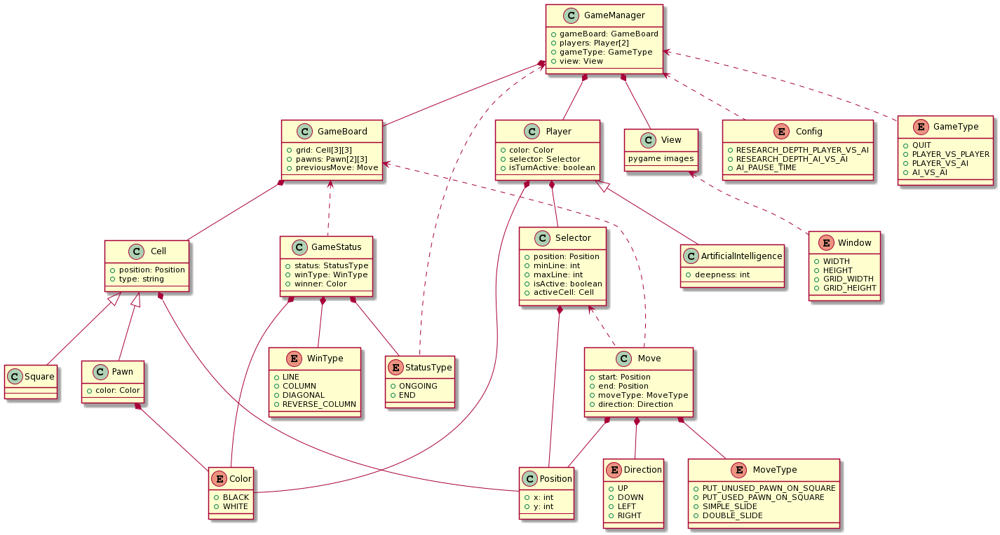

# Force-3
Jeu Force 3 années 80.

## Installation du projet
1. `git clone https://github.com/Gabryss/Force-3.git`
2. `cd ./Force-3`
3. `pip install -r requirements.txt`

## Lancer le projet
* `python Main.py`

## Désinstaller les packages
* `pip uninstall -r requirements.txt`

## UML

### Diagramme de classes

## Auteurs
* [Aurélien VASSEUR]()
* [Hicham ARAHHOU]()
* [Gabriel GARCIA]()
* [Kevin FRITSCH]()